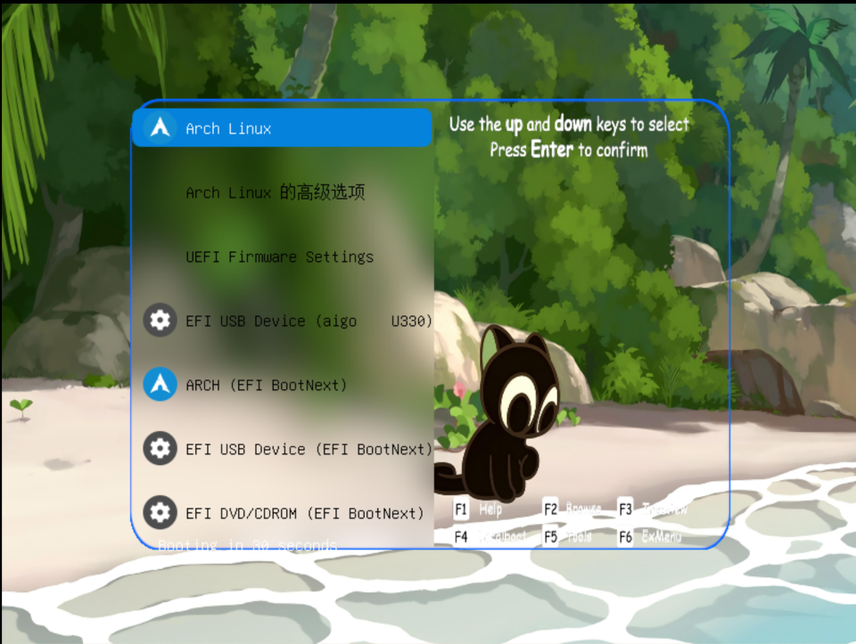
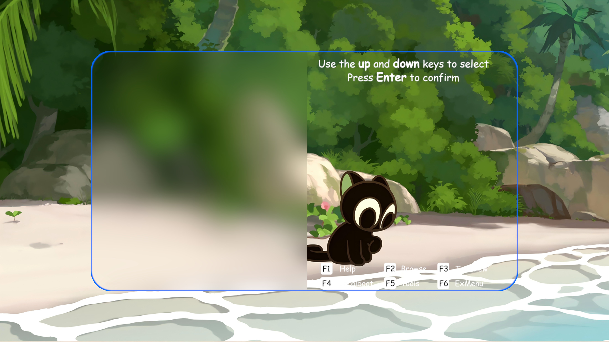

# Xiaohei GRUB Theme

这是一个罗小黑主题的GTUB样式，适用于4k及以下任意分辨率。



## 预览



## 特性

- 适用于任意分辨率
- 丛林风格背景
- 自定义字体（Cascadia Code / Comic Sans MS）
- 多系统图标支持（Arch、Ubuntu、Windows、Manjaro 等）
- 自定义倒计时提示

## 目录结构

```
XiaoHei/
├── background.png      # 背景图
├── background.pptx     # 背景图源文件
├── font/               # 字体文件
│   ├── CascadiaCode_18.pf2
│   ├── comic_16.pf2
│   └── comic_26.pf2
├── icons/              # 系统图标
│   ├── arch.png
│   ├── ubuntu.png
│   ├── windows.png
│   └── ...
├── info.png            # 提示信息图
├── select_c.png        # 选中项背景（中）
├── select_e.png        # 选中项背景（边）
├── select_w.png        # 选中项背景（宽）
└── theme.txt           # 主题配置文件
```

## 安装

1. 克隆或下载本仓库：

   ```bash
   git clone https://github.com/ZhX589/XiaoHei-GRUB.git
   ```

2. 将主题复制到 GRUB 主题目录：

   ```bash
   cd Xiaohei-GRUB && sudo cp -r XiaoHei /boot/grub/themes/
   ```

3. 编辑 `/etc/default/grub`，添加或修改：

   ```ini
   GRUB_THEME="/boot/grub/themes/XiaoHei/theme.txt"
   ```

4. 重新生成 GRUB 配置：

   ```bash
   sudo grub-mkconfig -o /boot/grub/grub.cfg
   ```

5. 重启生效：

   ```bash
   sudo reboot
   ```

## 自定义

主要配置都在 `theme.txt` 中，可以调整：

| 属性 | 说明 |
|---|---|
| `desktop-image` | 背景图 |
| `item_color` | 未选中项文字颜色 |
| `selected_item_color` | 选中项文字颜色 |
| `item_font` | 菜单字体 |
| `left` / `top` / `width` / `height` | 菜单位置和大小 |
| `color` | 倒计时文字颜色 |

修改后重新运行 `grub-mkconfig` 即可生效。

## 注意事项

- 字体文件为 `.pf2` 格式，如需更换字体，需先用 `grub-mkfont` 转换。
- 如果主题显示不全，可在 `/etc/default/grub` 中设置 `GRUB_GFXMODE=1920x1080`。
- 修改 `theme.txt` 后必须重新生成 `grub.cfg`，否则不会生效。

## 参考

[Shorin-ArchLinux-Guide](https://github.com/SHORiN-KiWATA/Shorin-ArchLinux-Guide/blob/main/wiki/archlinux/grub%E7%BE%8E%E5%8C%96.md)
[Arch Wiki](https://wiki.archlinux.org/title/GRUB)

## 许可

本项目仅供个人学习和使用。背景图、图标等素材版权归原作者所有。

